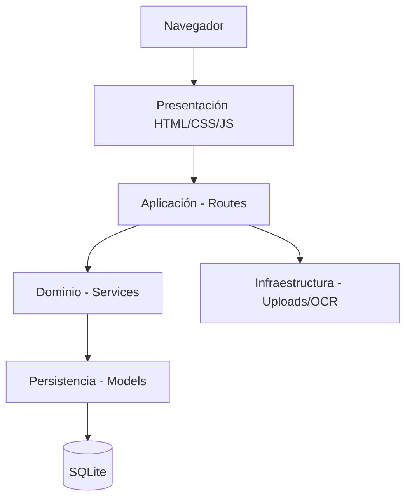

# 01 · Documento técnico

## 1. Identificación

| Campo | Valor |
|---|---|
| Sistema | Cartera — Gestión de Cartera y Cobranza |
| Tipo de documento | Especificación técnica y de arquitectura |
| Versión | 1.0 |
| Estado | Prototipo funcional (base para implementación y validación) |

## 2. Objetivo

Proveer un aplicativo web para la administración integral del ciclo de crédito:
registro de clientes y deudores, operaciones de préstamo, obligaciones de pago,
gestión de cartera, cobranza, recepción y aplicación de pagos, gestión documental,
generación de comprobantes y análisis de comportamiento financiero.

## 3. Alcance funcional

- Gestión de clientes y deudores, con referencias y codeudores.
- Gestión documental con carga, clasificación y consulta.
- Creación y administración de préstamos.
- Generación y seguimiento de cuotas u obligaciones.
- Gestión de cartera y de cobranza.
- Recepción y aplicación transaccional de pagos.
- Generación de recibos imprimibles.
- Indicadores financieros y score de comportamiento.
- Administración de usuarios, roles, permisos, parámetros y auditoría.

## 4. Arquitectura general

Se adopta una **arquitectura web ligera** (server-rendered), sin frontend SPA.
El backend está implementado en Python con Flask y el frontend con HTML/CSS/JavaScript.

### 4.1 Capas

| Capa | Responsabilidad | Ubicación |
|---|---|---|
| Presentación | Formularios, tablas, filtros, navegación y visualización. | `app/templates/`, `app/static/` |
| Aplicación | Rutas/controladores y coordinación de casos de uso. | `app/routes/` |
| Dominio / negocio | Reglas financieras, scoring, permisos. | `app/services/` |
| Persistencia | Entidades, relaciones y acceso a datos. | `app/models.py` |
| Infraestructura | Almacenamiento de archivos, OCR opcional. | `app/uploads/`, `app/routes/documents.py` |

### 4.2 Diagrama de capas



## 5. Stack tecnológico

| Componente | Tecnología |
|---|---|
| Lenguaje | Python 3.10+ |
| Framework web | Flask 3 |
| ORM | Flask-SQLAlchemy 3 (SQLAlchemy 2) |
| Autenticación | Flask-Login |
| Hashing de contraseñas | Werkzeug (PBKDF2) |
| Base de datos | SQLite (reemplazable por PostgreSQL/MySQL) |
| Frontend | HTML5, CSS3, JavaScript (vanilla) |

## 6. Módulos funcionales

1. **Panel principal** — indicadores de cartera, obligaciones por vencer/vencidas, pagos recientes.
2. **Clientes** — CRUD, referencias/codeudores, ficha integral y score.
3. **Préstamos** — creación con valor, interés, cuotas y fecha; generación de obligaciones.
4. **Cuotas / obligaciones** — capital, interés, saldo, días de mora y estado.
5. **Pagos** — registro transaccional, aplicación, recibo y anulación.
6. **Cobranza** — reporte de vencidos y registro de gestiones.
7. **Documentos** — carga, clasificación, descarga y OCR opcional.
8. **Cartera y analítica** — indicadores y distribución por estado.
9. **Score de comportamiento** — puntualidad, cumplimiento y mora.
10. **Administración** — usuarios, roles, permisos, parámetros y auditoría.

## 7. Flujo operativo principal


## 8. Organización del código

```
app/
  routes/         # controladores HTTP por módulo
  services/       # lógica de negocio (financiera, scoring, permisos)
  models.py       # entidades y relaciones
  templates/      # vistas HTML (Jinja2)
  static/         # CSS, JavaScript e imágenes
  seed.py         # datos iniciales (roles, permisos, usuario admin)
  config.py       # configuración por ambiente
run.py            # punto de entrada
tests/            # pruebas
docs/             # documentación técnica
```
