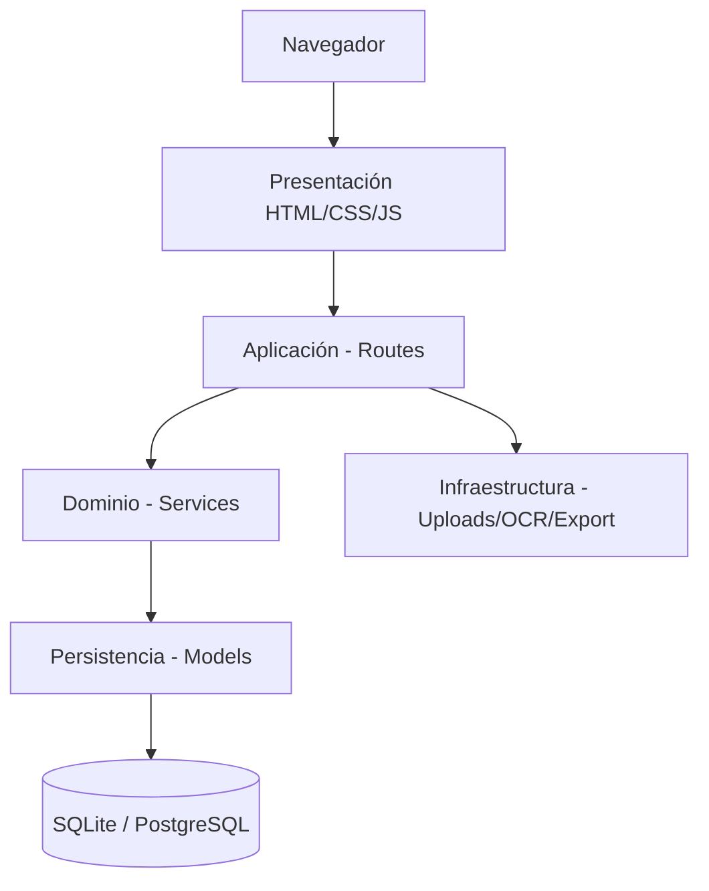

# 01 · Documento técnico

## 1. Identificación

| Campo | Valor |
|---|---|
| Sistema | Cartera — Gestión de Cartera y Cobranza |
| Tipo de documento | Especificación técnica y de arquitectura |
| Versión | 1.0 |
| Estado | Prototipo funcional (base para implementación y validación) |

## 2. Objetivo

Proveer un aplicativo web para la administración integral del ciclo de crédito:
registro de clientes y deudores, operaciones de préstamo, obligaciones de pago,
gestión de cartera, cobranza, recepción y aplicación de pagos, gestión documental,
generación de comprobantes y análisis de comportamiento financiero.

## 3. Alcance funcional

- Gestión de clientes y deudores, con referencias, codeudores, ubicación (ciudad) e información bancaria completa para transferencias/desembolsos.
- Gestión documental con carga, clasificación, descarga, previsualización y OCR inteligente para autocompletado.
- Creación y administración de préstamos con amortización francesa o alemana y tasa por período parametrizable.
- Carga y visualización de comprobantes de desembolso asociados al crédito.
- Generación y seguimiento de cuotas u obligaciones con cálculo de mora automático.
- Gestión de cartera y de cobranza con registro de gestiones y semaforización.
- Recepción y aplicación transaccional de pagos con orden de imputación dinámico (interés primero o capital primero).
- Generación de recibos ejecutivos oficiales listos para impresión limpia y exportación a PDF.
- Indicadores financieros, panel analítico y score de comportamiento crediticio con métricas consolidadas.
- Administración de usuarios, roles RBAC, permisos granulares, auditoría y parámetros en caliente.
- **Gestión avanzada de datos**: exportación completa a ZIP con archivos CSV limpios y legibles para Excel, purga segura de datos de prueba y recarga de datos demo.

## 4. Arquitectura general

Se adopta una **arquitectura web ligera** (server-rendered), sin frontend SPA.
El backend está implementado en Python con Flask y el frontend con HTML/CSS/JavaScript modular.

### 4.1 Capas

| Capa | Responsabilidad | Ubicación |
|---|---|---|
| Presentación | Formularios, tablas, filtros, navegación y visualización. | `app/templates/`, `app/static/` |
| Aplicación | Rutas/controladores y coordinación de casos de uso. | `app/routes/` |
| Dominio / negocio | Reglas financieras, scoring, permisos, OCR. | `app/services/` |
| Persistencia | Entidades, relaciones y acceso a datos. | `app/models.py` |
| Infraestructura | Almacenamiento de archivos privados, disco persistente. | `app/uploads/`, `app/routes/documents.py` |

### 4.2 Diagrama de capas



## 5. Stack tecnológico

| Componente | Tecnología |
|---|---|
| Lenguaje | Python 3.10+ |
| Framework web | Flask 3 |
| ORM | Flask-SQLAlchemy 3 (SQLAlchemy 2) |
| Autenticación | Flask-Login |
| Hashing de contraseñas | Werkzeug (PBKDF2 / scrypt) |
| Seguridad y Rate Limit | Flask-WTF (CSRF), Flask-Limiter |
| Extracción y OCR | PyMuPDF (fitz), Pillow, EasyOCR |
| Base de datos | SQLite (desarrollo/producción con volumen) / PostgreSQL |
| Frontend | HTML5, CSS3 moderno, JavaScript (vanilla) |

## 6. Módulos funcionales

1. **Panel principal** — indicadores de cartera, obligaciones por vencer/vencidas, pagos recientes y filtros.
2. **Clientes** — CRUD, referencias/codeudores, datos bancarios (banco, cuenta, titular), ficha integral y scoring.
3. **Préstamos** — creación con tasa periódica parametrizable, cuotas y fecha; comprobante de desembolso y cronograma.
4. **Cuotas / obligaciones** — capital, interés, saldo, días de mora y estado en tiempo real.
5. **Pagos** — registro transaccional, orden configurable (interés/capital), recibo ejecutivo imprimible y anulación.
6. **Cobranza** — reporte de vencidos, semáforo de riesgo y registro cronológico de gestiones de cobro.
7. **Documentos** — carga trazable, clasificación, descarga y OCR híbrido para agilizar altas.
8. **Cartera y analítica** — indicadores globales, distribución por estado y panel interactivo.
9. **Score de comportamiento** — calificación ponderada (0–100), bandas de riesgo y resumen precalculado.
10. **Administración y datos** — usuarios, roles, permisos, parámetros, auditoría, exportación CSV/Excel y purga/demo.

## 7. Flujo operativo principal


## 8. Organización del código

```
app/
  routes/         # controladores HTTP por módulo
  services/       # lógica de negocio (financiera, scoring, permisos)
  models.py       # entidades y relaciones
  templates/      # vistas HTML (Jinja2)
  static/         # CSS, JavaScript e imágenes
  seed.py         # datos iniciales (roles, permisos, usuario admin)
  config.py       # configuración por ambiente
run.py            # punto de entrada
tests/            # pruebas
docs/             # documentación técnica
```
