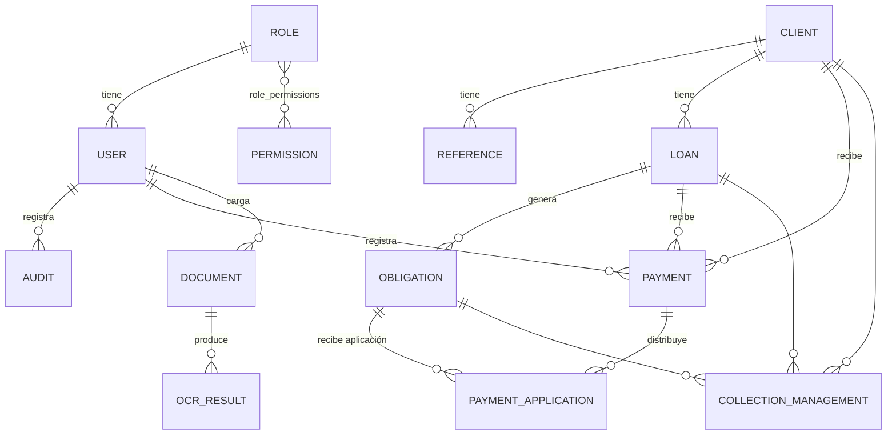

# 02 · Modelo de datos

## 1. Diagrama entidad-relación

## 2. Entidades y campos

### Usuario (`users`)
| Campo | Tipo | Descripción |
|---|---|---|
| id | int PK | Identificador |
| username | str (único) | Nombre de acceso |
| email | str | Correo |
| full_name | str | Nombre completo |
| password_hash | str | Hash de contraseña |
| role_id | FK | Rol asignado |
| active | bool | Estado de la cuenta |
| created_at | datetime | Fecha de creación |

### Rol (`roles`) y Permiso (`permissions`)
| Entidad | Campos |
|---|---|
| Rol | id, name, description |
| Permiso | id, name, code, description |
| Relación | `role_permissions` (role_id, permission_id) |

### Cliente (`clients`)
| Campo | Tipo | Descripción |
|---|---|---|
| id | int PK | Identificador interno |
| code | str (único) | Código de cliente (`CL-00001`) |
| first_name / last_name | str | Nombres y apellidos |
| identification_type | str | Tipo de documento (`CC`, `CE`, `NIT`, `PAS`) |
| identification_number | str (index) | Número de documento de identidad |
| country | str | País (`Colombia` por defecto) |
| city | str | Ciudad de residencia u operación |
| address | str | Dirección física de residencia o negocio |
| phone | str | Teléfono principal de contacto |
| email | str | Correo electrónico |
| bank_name | str | Entidad bancaria para transferencias o desembolsos |
| account_type | str | Tipo de cuenta (Ahorros, Corriente, Nequi/Daviplata) |
| account_number | str | Número de cuenta bancaria |
| account_holder | str | Titular de la cuenta para verificación |
| created_at / updated_at | datetime | Marcas temporales de auditoría |

### Referencia / Codeudor (`references`)
| Campo | Tipo | Descripción |
|---|---|---|
| id | int PK | Identificador |
| client_id | FK | Cliente asociado |
| full_name | str | Nombre completo |
| relationship | str | Parentesco / Relación (`Referencia personal`, `Codeudor`) |
| identification_number | str | Documento de identidad |
| phone | str | Teléfono de contacto |
| address | str | Dirección física |

### Préstamo (`loans`)
| Campo | Tipo | Descripción |
|---|---|---|
| id | int PK | Identificador |
| code | str (único) | Código del crédito (`PR-00001`) |
| client_id | FK | Cliente deudor |
| principal | decimal | Valor desembolsado / principal |
| annual_rate | decimal | Tasa periódica en decimal (ej. 0.20 = 20% por período) |
| installments_count | int | Número de cuotas pactadas |
| frequency_days | int | Periodicidad en días (15 quincenal, 30 mensual) |
| amortization_type | str | Sistema de amortización (`frances` o `aleman`) |
| start_date | date | Fecha inicial del crédito |
| status | str | `activo`, `mora`, `pagado`, `cancelado` |
| created_at | datetime | Fecha de creación del préstamo |

### Obligación (`obligations`)
| Campo | Tipo | Descripción |
|---|---|---|
| id | int PK | Identificador |
| loan_id | FK | Préstamo al que pertenece |
| number | int | Número correlativo de cuota (1 a N) |
| due_date | date | Fecha límite de vencimiento |
| scheduled_value | decimal | Valor programado total de la cuota |
| capital / interest | decimal | Composición inicial (capital e interés) |
| pending_capital / pending_interest | decimal | Saldo pendiente por amortizar |
| status | str | `pendiente`, `parcial`, `pagada` |
| paid_date | date | Fecha efectiva de pago total |

### Pago (`payments`) y Aplicación (`payment_applications`)
| Entidad | Campos |
|---|---|
| Pago | id, code (`PG-00001`), client_id, loan_id, amount, payment_date, concept, receipt_number, status (`aplicado`, `anulado`), registered_by, created_at |
| Aplicación | id, payment_id, obligation_id, capital_applied, interest_applied, created_at |

### Documento (`documents`) y OCR (`ocr_results`)
| Entidad | Campos |
|---|---|
| Documento | id, entity_type (`cliente`, `prestamo`, `pago`), entity_id, doc_type (`identificacion`, `fachada`, `comprobante`, `contrato`), original_name, stored_name, extension, size, uploaded_by, uploaded_at |
| OCR | id, document_id, extracted_text, fields_json, created_at |

> **Nomenclatura física trazable de archivos subidos:**  
> Los archivos se guardan en `UPLOAD_FOLDER` estructurados por entidad con aislamiento físico:  
> `{entidad}/{entity_id}/{entidad}-{entity_id}-{tipo}-{AAAAMMDD}-{uuid8}.{ext}`  
> Ejemplo: `cliente/12/cliente-12-identificacion-20260820-a1b2c3d4.png` o `prestamo/5/prestamo-5-comprobante-20260901-f3e4d2a1.pdf`.  
> `original_name` conserva el nombre provisto por el usuario para visualización limpia.

### Gestión de cobranza (`collection_management`)
id, client_id, loan_id, obligation_id, action (`llamada`, `visita`, `mensaje`, `acuerdo`), notes, next_date, created_by, created_at.

### Auditoría (`audit`)
id, user_id, action, entity, entity_id, details, created_at.

### Parámetro (`parameters`)
id, key, value, description, category (`financieros`, `cobranza`, `scoring`, `generales`), kind (`text`, `number`, `boolean`).

Parámetros estándar del sistema:
- `tasa_interes_periodo`: Tasa de interés porcentual por período de cuota (por defecto `20.0`).
- `metodo_interes`: Algoritmo predeterminado (`frances` o `aleman`).
- `periodicidad_interes`: Periodicidad habitual (`quincenal`, `mensual`).
- `orden_aplicacion_pago`: Prioridad de imputación (`interes_primero` o `capital_primero`).
- `tasa_mora_diaria`: Tasa de mora diaria de referencia (`0.001`).
- `dias_proximos_vencer`: Ventana en días para alertas preventivas (`15`).
- `dias_alerta_mora`: Umbral de días para semáforo de mora (`5`).
- `peso_puntualidad`: Ponderación de puntualidad en score (`0.45`).
- `peso_cumplimiento`: Ponderación de cumplimiento en score (`0.35`).
- `peso_mora`: Ponderación de mora en score (`0.20`).
- `dias_max_mora_score`: Límite superior de días de mora para escala de penalización (`90`).

## 3. Estados y semántica

| Entidad | Estados | Significado |
|---|---|---|
| Préstamo | `activo` | En curso, al día con sus cuotas |
| Préstamo | `mora` | Posee al menos una cuota no pagada con fecha vencida |
| Préstamo | `pagado` | Saldo insoluto total igual a cero |
| Préstamo | `cancelado` | Anulado administrativamente |
| Obligación | `pendiente` | Sin abonos registrados |
| Obligación | `parcial` | Con abono registrado pero saldo remanente > 0 |
| Obligación | `pagada` | Saldo de capital e interés completamente cubierto |
| Pago | `aplicado` | Imputado a obligaciones y contabilizado |
| Pago | `anulado` | Revertido transaccionalmente (restaura saldos anteriores) |

Los días de mora (`days_late`) se evalúan dinámicamente como la diferencia en días entre la fecha actual y `due_date` cuando la cuota no está pagada y la fecha de vencimiento es anterior a hoy.
