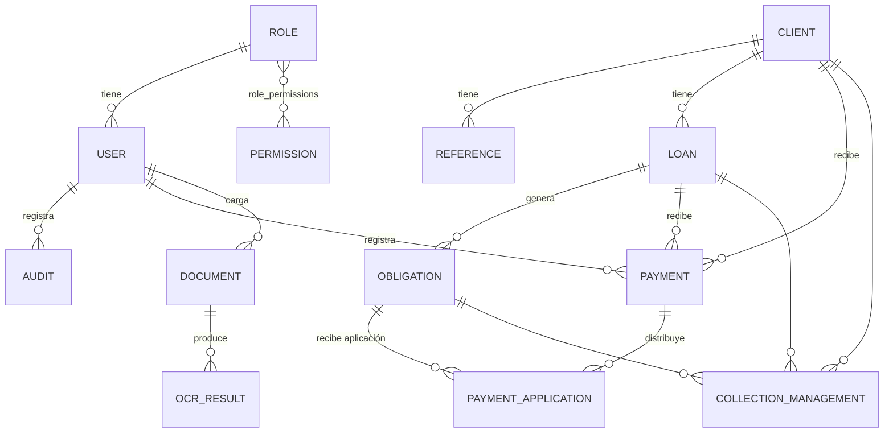

# 02 · Modelo de datos

## 1. Diagrama entidad-relación

## 2. Entidades y campos

### Usuario (`users`)
| Campo | Tipo | Descripción |
|---|---|---|
| id | int PK | Identificador |
| username | str (único) | Nombre de acceso |
| email | str | Correo |
| full_name | str | Nombre completo |
| password_hash | str | Hash de contraseña |
| role_id | FK | Rol asignado |
| active | bool | Estado de la cuenta |
| created_at | datetime | Fecha de creación |

### Rol (`roles`) y Permiso (`permissions`)
| Entidad | Campos |
|---|---|
| Rol | id, name, description |
| Permiso | id, name, code, description |
| Relación | `role_permissions` (role_id, permission_id) |

### Cliente (`clients`)
| Campo | Tipo | Descripción |
|---|---|---|
| id | int PK | Identificador |
| code | str (único) | Código interno |
| first_name / last_name | str | Nombres y apellidos |
| identification_type / identification_number | str | Documento de identidad |
| country, address, phone, email | str | Contacto |

### Referencia / Codeudor (`references`)
| Campo | Tipo | Descripción |
|---|---|---|
| id | int PK | Identificador |
| client_id | FK | Cliente asociado |
| full_name | str | Nombre |
| relationship | str | Referencia / Codeudor |
| identification_number, phone, address | str | Contacto |

### Préstamo (`loans`)
| Campo | Tipo | Descripción |
|---|---|---|
| id | int PK | Identificador |
| code | str (único) | Código interno |
| client_id | FK | Deudor |
| principal | decimal | Valor principal |
| annual_rate | decimal | Interés anual (ej. 0.24) |
| installments_count | int | Número de cuotas |
| frequency_days | int | Periodicidad (días) |
| start_date | date | Fecha de inicio |
| status | str | activo / mora / pagado / cancelado |

### Obligación (`obligations`)
| Campo | Tipo | Descripción |
|---|---|---|
| id | int PK | Identificador |
| loan_id | FK | Préstamo |
| number | int | Número de cuota |
| due_date | date | Vencimiento |
| scheduled_value | decimal | Valor programado |
| capital / interest | decimal | Composición de la cuota |
| pending_capital / pending_interest | decimal | Saldo pendiente |
| status | str | pendiente / parcial / pagada |
| paid_date | date | Fecha de pago |

### Pago (`payments`) y Aplicación (`payment_applications`)
| Entidad | Campos |
|---|---|
| Pago | id, code, client_id, loan_id, amount, payment_date, concept, receipt_number, status, registered_by |
| Aplicación | id, payment_id, obligation_id, capital_applied, interest_applied |

### Documento (`documents`) y OCR (`ocr_results`)
| Entidad | Campos |
|---|---|
| Documento | id, entity_type, entity_id, doc_type, original_name, stored_name, extension, size, uploaded_by, uploaded_at |
| OCR | id, document_id, extracted_text, fields_json, created_at |

> **Nomenclatura de archivos subidos:** los archivos se guardan en `UPLOAD_FOLDER`
> con subcarpetas por entidad y un nombre trazable:
> `{entidad}/{entity_id}/{entidad}-{entity_id}-{tipo}-{AAAAMMDD}-{uuid8}.{ext}`
> Ejemplo: `cliente/12/cliente-12-identificacion-20260820-a1b2c3d4.png`.
> Esto permite identificar a qué cliente/entidad pertenece cada archivo y
> mantener el orden físico. `original_name` conserva el nombre original del
> usuario para mostrarlo en la interfaz.

### Gestión de cobranza (`collection_management`)
id, client_id, loan_id, obligation_id, action, notes, next_date, created_by, created_at.

### Auditoría (`audit`)
id, user_id, action, entity, entity_id, details, created_at.

### Parámetro (`parameters`)
id, key, value, description, category, kind (text | number | boolean).

## 3. Estados y semántica

| Entidad | Estados |
|---|---|
| Préstamo | `activo`, `mora`, `pagado`, `cancelado` |
| Obligación | `pendiente`, `parcial`, `pagada` |
| Pago | `aplicado`, `anulado` |

Los días de mora se calculan dinámicamente como la diferencia entre la fecha actual
y `due_date` cuando la obligación no está pagada y la fecha ya venció.
