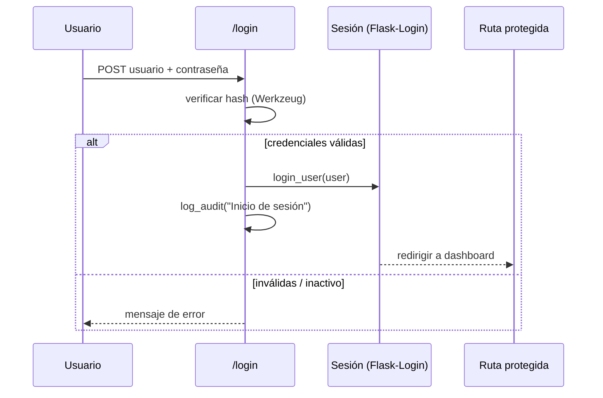
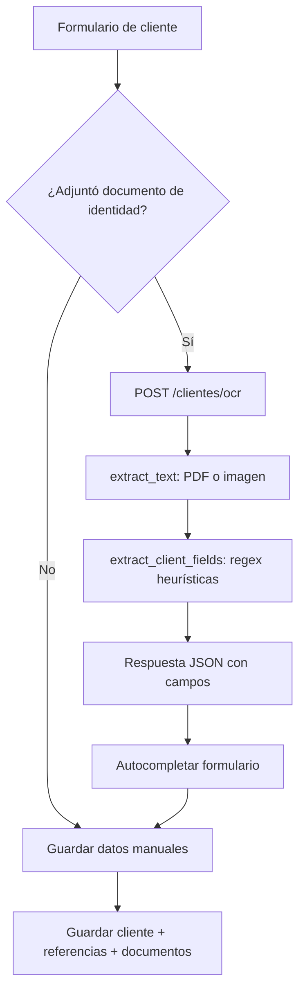
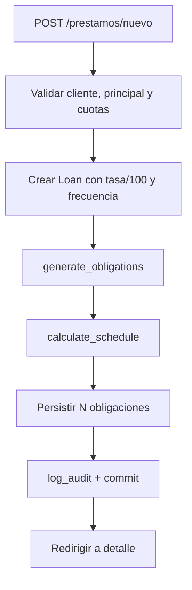
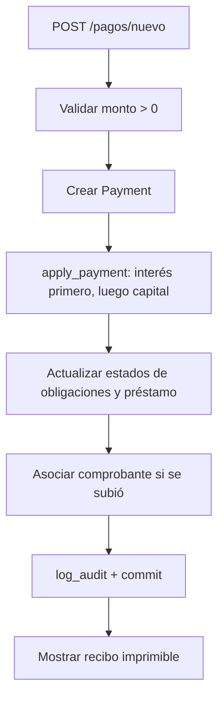

# Manual Técnico — Cartera · Sistema de Gestión de Cartera y Cobranza

> Documento de referencia técnica completa. Cubre arquitectura, modelo de datos,
> motor financiero, motor de scoring, flujos de negocio, OCR, seguridad y
> despliegue. Última actualización: agosto de 2026.

---

## Tabla de contenidos

1. [Resumen ejecutivo](#1-resumen-ejecutivo)
2. [Arquitectura general](#2-arquitectura-general)
3. [Estructura del proyecto](#3-estructura-del-proyecto)
4. [Modelo de datos](#4-modelo-de-datos)
5. [Motor financiero](#5-motor-financiero)
6. [Motor de scoring](#6-motor-de-scoring)
7. [Flujos de negocio](#7-flujos-de-negocio)
8. [OCR y extracción de datos](#8-ocr-y-extracción-de-datos)
9. [Seguridad y permisos](#9-seguridad-y-permisos)
10. [Configuración y parámetros](#10-configuración-y-parámetros)
11. [Despliegue](#11-despliegue)
12. [Pruebas](#12-pruebas)
13. [Solución de problemas](#13-solución-de-problemas)

---

## 1. Resumen ejecutivo

**Cartera** es una aplicación web para la administración integral de una cartera
de microcréditos: clientes, préstamos, obligaciones (cuotas), pagos, gestión de
cobranza, documentos digitalizados y análisis de comportamiento (score).

| Aspecto | Detalle |
|---|---|
| Lenguaje | Python 3.10+ |
| Framework | Flask (Blueprints) |
| ORM | Flask-SQLAlchemy / SQLAlchemy 2.x |
| Autenticación | Flask-Login + hash de contraseñas Werkzeug |
| Base de datos | SQLite (desarrollo) / PostgreSQL (producción) |
| OCR | EasyOCR (imágenes) + PyMuPDF (PDF) |
| Motor financiero | Amortización francesa / alemana, aplicación transaccional de pagos |
| Scoring | Score de comportamiento 0–100 con pesos ponderados |
| Despliegue | Render (gunicorn) / PythonAnywhere |

---

## 2. Arquitectura general

La aplicación sigue una separación de capas ligera:

```
Presentación      app/templates/*  (Jinja2) + app/static/*
Aplicación        app/routes/*     (Blueprints: controladores y orquestación)
Servicios         app/services/*   (reglas de negocio puras y testeables)
Dominio/Persist.  app/models.py    (SQLAlchemy models)
Configuración     app/config.py    (variables de entorno)
```

### Blueprints (módulos) y sus rutas

| Blueprint | Prefijo | Responsabilidad |
|---|---|---|
| `auth` | `/` | Login / logout |
| `dashboard` | `/` | Indicadores de cartera |
| `clients` | `/clientes` | CRUD de clientes, referencias, OCR de autocompletado |
| `loans` | `/prestamos` | Creación y consulta de préstamos + generación de cuotas |
| `payments` | `/pagos` | Registro, aplicación, recibo y anulación de pagos |
| `collections` | `/cobranza` | Reporte de vencidos y registro de gestiones |
| `documents` | `/documentos` | Carga, descarga, OCR y reemplazo de documentos |
| `reports` | `/reportes` | Cartera y score |
| `admin` | `/admin` | Usuarios, roles, parámetros y auditoría |

### Inicialización (`app/__init__.py`)

Al crear la app (`create_app()`):

1. Se cargan la configuración (`Config`) y las extensiones (`db`, `login_manager`).
2. Se crea la carpeta `UPLOAD_FOLDER`.
3. Se registran los filtros de plantilla `money`, `d` (fecha) y `pct`.
4. Se registran los manejadores de error `403` y `404`.
5. En un `app_context` se ejecuta `db.create_all()`, una migración liviana
   (`_ensure_columns`) y el sembrado inicial (`seed_if_empty`, `seed_parameters`).

> **Dato importante**: en desarrollo (`AUTH_DISABLED = True`, cuando no hay
> `DATABASE_URL`), un `before_request` autentica automáticamente al usuario
> `admin` para facilitar la demo.

---

## 3. Estructura del proyecto

```
├── run.py                     # Punto de entrada (app.run)
├── wsgi.py                    # Punto de entrada WSGI (gunicorn)
├── requirements.txt           # Dependencias
├── Procfile / render.yaml     # Configuración de despliegue
├── app/
│   ├── __init__.py            # Fábrica de aplicación
│   ├── config.py              # Configuración
│   ├── extensions.py          # db, login_manager
│   ├── models.py              # Modelos SQLAlchemy
│   ├── seed.py                # Roles, permisos, parámetros, admin
│   ├── routes/                # Blueprints (auth, clients, loans, ...)
│   ├── services/              # financial, scoring, ocr, documents, decorators
│   ├── static/                # CSS, JS, imágenes
│   ├── templates/             # Vistas Jinja2
│   └── uploads/               # Archivos subidos (ignorado por git)
├── docs/                      # Documentación técnica
├── tests/                     # Pruebas (unittest)
└── DOCs prueba/               # Documentos de prueba para la demo
```

---

## 4. Modelo de datos

### 4.1 Entidades principales

| Tabla | Descripción | Campos clave |
|---|---|---|
| `users` | Usuarios del sistema | username, password_hash, role_id, active |
| `roles` | Roles | name, description |
| `permissions` | Permisos granulares | code, name |
| `role_permissions` | Relación N:M roles ↔ permisos | role_id, permission_id |
| `clients` | Clientes | code, first_name, last_name, identification_number, phone, email |
| `references` | Referencias/codeudores del cliente | full_name, relationship, phone |
| `loans` | Préstamos | principal, annual_rate, installments_count, frequency_days, amortization_type, status |
| `obligations` | Cuotas generadas | number, due_date, scheduled_value, capital, interest, pending_capital, pending_interest, status |
| `payments` | Pagos | amount, payment_date, status, receipt_number |
| `payment_applications` | Aplicación de pago a cuota | capital_applied, interest_applied |
| `documents` | Documentos digitales | entity_type, entity_id, doc_type, stored_name, original_name |
| `ocr_results` | Resultados de OCR | extracted_text, fields_json |
| `collection_management` | Gestiones de cobranza | action, notes, next_date |
| `audit` | Auditoría | action, entity, entity_id, details |
| `parameters` | Parámetros configurables | key, value, category, kind |

### 4.2 Relaciones

- `Client 1—N Loan` (un cliente puede tener varios préstamos)
- `Client 1—N Reference` (cascade delete-orphan)
- `Loan 1—N Obligation` (ordenadas por `number`, cascade)
- `Loan 1—N Payment`
- `Payment 1—N PaymentApplication` / `Obligation 1—N PaymentApplication`
- `Document N—1 ...` vía `entity_type` + `entity_id` (polimórfico: cliente, prestamo, pago)
- `Document 1—N OCRResult`
- `Role N—M Permission` (tabla intermedia)
- `User N—1 Role`

### 4.3 Códigos generados automáticamente

| Entidad | Prefijo | Formato |
|---|---|---|
| Cliente | `CL-` | `CL-00001` |
| Préstamo | `PR-` | `PR-00001` |
| Pago | `PG-` | `PG-00001` |

### 4.4 Nomenclatura de archivos subidos

Los documentos se guardan con trazabilidad física:

```
{entidad}/{entity_id}/{entidad}-{entity_id}-{tipo}-{AAAAMMDD}-{uuid8}.{ext}
```

Ejemplo: `cliente/12/cliente-12-identificacion-20260820-a1b2c3d4.png`.

`original_name` conserva el nombre original del usuario para mostrarlo en la UI.

---

## 5. Motor financiero

Implementado en `app/services/financial.py`. Todas las operaciones usan
`Decimal` con redondeo `ROUND_HALF_UP` a 2 decimales (función `money()`).

### 5.1 Tasa periódica

El préstamo almacena `annual_rate` en forma decimal (0.24 = 24 % anual).
La tasa del período se calcula con **convención 360 días**:

```
tasa_periodo = tasa_anual × (frecuencia_días / 360)
```

Ejemplo: tasa anual 24 % y cuotas cada 30 días → `0.24 × (30/360) = 0.02` (2 %).

### 5.2 Amortización francesa (cuota fija)

Fórmula de anualidad:

```
cuota = principal × i / (1 − (1 + i)^−n)
```

donde `i = tasa_periodo` y `n = número de cuotas`.

Para cada cuota `k`:

```
interés_k    = saldo_anterior × i          (redondeado a céntimos)
capital_k    = cuota − interés_k           (redondeado a céntimos)
saldo        = saldo_anterior − capital_k
```

En la **última cuota**, `capital = saldo_anterior` (para absorber el redondeo y
liquidar exactamente el principal).

**Ejemplo concreto** — Préstamo de $1,000,000, 24 % anual, 6 cuotas mensuales:

```
i = 0.24 × (30/360) = 0.02
cuota = 1,000,000 × 0.02 / (1 − (1.02)^−6) ≈ 178,525.81
```

| Cuota | Interés | Capital | Saldo |
|---|---|---|---|
| 1 | 20,000.00 | 158,525.81 | 841,474.19 |
| 2 | 16,829.48 | 161,696.33 | 679,777.86 |
| 3 | 13,595.56 | 164,930.25 | 514,847.61 |
| 4 | 10,296.95 | 168,228.86 | 346,618.75 |
| 5 | 6,932.38 | 171,593.43 | 175,025.32 |
| 6 | 3,500.49 | 175,025.32 | 0.00 |

*(Cifras ilustrativas redondeadas a 2 decimales; el sistema aplica `ROUND_HALF_UP` en cada paso.)*

### 5.3 Amortización alemana (capital fijo)

```
capital_fijo = principal / n          (redondeado a céntimos)
interés_k    = saldo_anterior × i
cuota_k      = capital_fijo + interés_k
```

La cuota es **decreciente** (el interés baja con el saldo). En la última cuota,
`capital = saldo_anterior`.

### 5.4 Aplicación de pagos (`apply_payment`)

Al registrar un pago se aplica de forma **transaccional** sobre las cuotas
pendientes, **ordenadas por fecha de vencimiento y número** (la más antigua
primero). El orden de imputación es:

```
1. Intereses pendientes de la obligación más antigua.
2. Capital pendiente de esa misma obligación.
3. Continúa con la siguiente obligación.
```

Pseudoalgoritmo:

```
restante = monto_pago
for obligación in pendientes(ordenadas):
    if restante <= 0: break
    interés_aplicar = min(interés_pendiente, restante)
    restante -= interés_aplicar
    capital_aplicar = min(capital_pendiente, restante)
    restante -= capital_aplicar

    actualizar pendientes y estado:
        pendiente_capital -= capital_aplicar
        pendiente_interés -= interés_aplicar
        estado = "pagada" si saldo_pendiente <= 0, si no "parcial"
    registrar PaymentApplication(capital, interés)
```

Si sobra dinero tras cubrir todas las cuotas, el excedente queda registrado
(no se genera saldo a favor automático).

### 5.5 Estado del préstamo tras un pago

```
saldo_pendiente_total <= 0  → "pagado"
hay cuotas no pagadas con días_mora > 0 → "mora"
en otro caso → "activo"
```

### 5.6 Anulación de pago (reversión)

En `payments.revert`, se recorren las `PaymentApplication` del pago y se
**restauran** los saldos de cada obligación:

```
pendiente_capital += capital_aplicado
pendiente_interés += interés_aplicado
estado = "pendiente"; fecha_pago = None
```

El pago pasa a estado `anulado` y el préstamo vuelve a `activo`.

### 5.7 Días de mora

```
días_mora = (hoy − fecha_vencimiento).días   si fecha_vencimiento < hoy y no está pagada
            0                                 en otro caso
```

---

## 6. Motor de scoring

Implementado en `app/services/scoring.py`. Produce un score **0–100** basado en
el historial verificable del cliente (sus obligaciones).

### 6.1 Componentes

| Componente | Definición | Peso |
|---|---|---|
| **Puntualidad** | Proporción de cuotas pagadas a tiempo (`paid_date ≤ due_date`) sobre el total | 0.45 |
| **Cumplimiento** | Proporción de cuotas pagadas sobre el total | 0.35 |
| **Mora** | Penalización por días de mora y número de cuotas vencidas | 0.20 |

### 6.2 Fórmulas

```
puntualidad    = pagadas_a_tiempo / total
cumplimiento   = pagadas / total
mora_score     = max(0, 1 − (max_días_mora / 90))
mora_score     = max(0, mora_score − (cuotas_vencidas × 0.05))

score = 100 × (0.45·puntualidad + 0.35·cumplimiento + 0.20·mora_score)
score = clamp(round(score), 0, 100)
```

### 6.3 Bandas

| Score | Banda |
|---|---|
| ≥ 80 | Excelente |
| 60–79 | Bueno |
| 40–59 | Regular |
| < 40 | Riesgo alto |

Si el cliente no tiene obligaciones, devuelve `score = None` con el detalle
"Sin historial suficiente".

> **Nota de implementación**: los parámetros `peso_puntualidad`,
> `peso_cumplimiento` y `peso_mora` existen en la tabla `parameters`, pero el
> cálculo actual usa los pesos fijos 0.45 / 0.35 / 0.20. Si se requiere hacerlos
> dinámicos, basta leerlos con `Parameter.get(...)` dentro de `compute_score`.

---

## 7. Flujos de negocio

### 7.1 Autenticación y autorización



Cada ruta está decorada con `@login_required` y `@permission_required("código")`.
El decorador `permission_required` verifica:

1. Usuario autenticado (si no → `401`).
2. `current_user.has_permission(code)` (si no → `403`).

El rol **Administrador** tiene acceso total (bypass de permisos).

### 7.2 Creación de cliente (con OCR)



- Al guardar, se genera `code = CL-XXXXX`, se validan nombre e identificación,
  se persisten referencias y se asocian los documentos (`identificacion`,
  `fachada`).
- El OCR del documento de identidad sugiere: nombres, apellidos, cédula,
  teléfono, dirección y email.

### 7.3 Creación de préstamo



### 7.4 Registro de pago



### 7.5 Gestión de cobranza

1. `/cobranza` lista las obligaciones vencidas (no pagadas con `due_date < hoy`),
   ordenadas por fecha de vencimiento.
2. `/cobranza/gestion/<obligation_id>` registra una gestión: acción
   (llamada, visita, mensaje, acuerdo), notas y próxima fecha.
3. `/cobranza/gestiones` muestra el histórico.

### 7.6 Gestión documental

1. Subida validada por extensión (`ALLOWED_EXTENSIONS`) y tamaño (15 MB).
2. El archivo se guarda con nomenclatura trazable (ver §4.4).
3. Se puede descargar, reemplazar (invalida OCR previos) y eliminar.
4. OCR: PDF (texto incrustado vía PyMuPDF; si es escaneado, se renderiza a
   imagen y se aplica EasyOCR) e imágenes (EasyOCR).

---

## 8. OCR y extracción de datos

Implementado en `app/services/ocr.py`.

### 8.1 Motores

| Formato | Motor | Comportamiento |
|---|---|---|
| PDF con texto | PyMuPDF (`fitz`) | Extrae el texto incrustado |
| PDF escaneado | PyMuPDF → render a imagen → EasyOCR | Si `get_text()` da < 50 chars, se renderiza a 150 dpi y se aplica OCR |
| Imagen (png, jpg, jpeg, gif, webp, bmp, tiff) | EasyOCR | OCR directo |

### 8.2 Preprocesado de imagen

Antes del OCR, la imagen pasa por `_prepare_image`:

1. Decodificación (PIL) respetando la **rotación EXIF** (fotos de celular).
2. Conversión a RGB.
3. **Redimensionado** al rango objetivo (1200–1600 px de lado mayor): reduce
   imágenes enormes (evita OOM y acelera) y amplía imágenes diminutas.
4. **Autocontraste** (`ImageOps.autocontrast`): clave para leer texto sobre el
   fondo con filigrana de la cédula.

### 8.3 Extracción de campos (`extract_client_fields`)

Sobre el texto OCR se aplican heurísticas posicionales y regex:

| Campo | Estrategia |
|---|---|
| `identification_number` | Búsqueda tras etiquetas (`NUMERO`, `CEDULA`, `CC`, `N°`, `DOCUMENTO`) o línea "solo número". Normaliza `O→0`, `l→1`, `I→1` |
| `last_name` / `first_name` | Tras etiquetas `APELLIDOS` / `NOMBRES` (con o sin dos puntos), o en la línea anterior (cédula nueva colombiana) |
| `phone` | Regex de celular colombiano (`3XX XXX XXXX`, opcional `+57`), con normalización |
| `email` | Regex de correo |
| `address` | Tras `DIRECCION` / `DIR.` / `ADDRESS` |

### 8.4 Robustez

- Captura `BaseException` (incluye `MemoryError`) y registra en el log en lugar
  de fallar silenciosamente.
- El endpoint `/clientes/ocr` devuelve **siempre JSON** (incluso en error), con
  mensajes amigables.
- El frontend valida el tamaño (> 15 MB) antes de subir y muestra mensajes
  claros ("Analizando documento…", "No se detectaron campos", etc.).

> **Nota de rendimiento**: EasyOCR sin GPU tarda ~16 s en cargar el modelo la
> primera vez + 5–60 s por imagen según tamaño. El preprocesado mitiga el costo.

---

## 9. Seguridad y permisos

### 9.1 Autenticación

- Contraseñas con hash **Werkzeug** (`generate_password_hash` / `check_password_hash`).
- Sesiones gestionadas por **Flask-Login**.
- Usuarios inactivos no pueden iniciar sesión.
- En desarrollo, `AUTH_DISABLED` permite auto-login para la demo.

### 9.2 Autorización (RBAC)

- `Role → Permission` (N:M). `User → Role` (N:1).
- `User.has_permission(code)`: el rol **Administrador** retorna `True` siempre;
  los demás consultan `role.has_permission(code)`.
- 19 permisos granulares (ver `app/seed.py`), por ejemplo `clients.create`,
  `loans.create`, `payments.revert`, `admin.audit`.

### 9.3 Roles predefinidos

| Rol | Permisos |
|---|---|
| **Administrador** | Acceso total |
| **Operador de cobranza** | Panel, clientes (CRUD), préstamos, pagos, cobranza, documentos, reportes |
| **Consulta** | Solo lectura (view en todos los módulos) |

### 9.4 Auditoría

Toda acción sensible se registra en la tabla `audit`: login/logout, creación y
edición de clientes, préstamos, pagos, anulaciones, gestiones, documentos,
usuarios, roles y parámetros. Incluye usuario, acción, entidad, id y detalles.

### 9.5 Otros

- `MAX_CONTENT_LENGTH = 15 MB` y lista blanca de extensiones.
- Manejadores de error 403/404 con plantillas propias.
- Clave secreta por variable de entorno (`SECRET_KEY`).

---

## 10. Configuración y parámetros

### 10.1 Variables de entorno

| Variable | Propósito | Default |
|---|---|---|
| `SECRET_KEY` | Firma de sesiones | valor de desarrollo |
| `DATABASE_URL` | URI de BD (PostgreSQL en prod) | SQLite `app/cartera.db` |
| `AUTH_DISABLED` | Desactivar login (demo) | `true` si no hay `DATABASE_URL` |
| `UPLOAD_FOLDER` | Carpeta de archivos | `app/uploads` |

### 10.2 Parámetros de BD (`parameters`)

| Clave | Categoría | Descripción | Default |
|---|---|---|---|
| `metodo_interes` | financieros | Método de amortización | `frances` |
| `periodicidad_interes` | financieros | Periodicidad del interés | `mensual` |
| `orden_aplicacion_pago` | financieros | Orden de aplicación | `interes_primero` |
| `tasa_mora_diaria` | financieros | Tasa de mora (referencial) | `0.001` |
| `dias_proximos_vencer` | cobranza | Horizonte de por vencer | `15` |
| `dias_alerta_mora` | cobranza | Alerta de mora temprana | `5` |
| `peso_puntualidad` | scoring | Peso de puntualidad | `0.45` |
| `peso_cumplimiento` | scoring | Peso de cumplimiento | `0.35` |
| `peso_mora` | scoring | Peso de mora | `0.20` |
| `dias_max_mora_score` | scoring | Días para escalar penalización | `90` |

> El panel de administración permite editar y crear parámetros en caliente.

---

## 11. Despliegue

### 11.1 Render

- `Procfile`: `web: gunicorn wsgi:app`.
- `render.yaml` declara el servicio web, el build y las variables de entorno.
- Se recomienda `DATABASE_URL` (PostgreSQL) y `SECRET_KEY` en producción.
- `psycopg2-binary` es el driver de PostgreSQL.

### 11.2 PythonAnywhere

- WSGI apunta a `wsgi:app` (ver `docs/07-despliegue-pythonanywhere.md`).

### 11.3 Consideraciones de OCR en producción

- **easyocr** descarga modelos (~64 MB) en `~/.EasyOCR/model` en la primera
  ejecución. Puede requerir más tiempo de build y RAM.
- Si el OCR no es crítico en el servidor, el código degrada con elegancia
  (devuelve texto vacío / mensajes amigables) si EasyOCR/PyMuPDF no están.

---

## 12. Pruebas

- `tests/test_smoke.py` (unittest estándar, sin dependencias extra).
- Ejecución:

```powershell
.\.venv\Scripts\python.exe -m unittest tests.test_smoke -v
```

- El motor financiero está diseñado como **funciones puras** (`calculate_schedule`,
  `apply_payment`) para facilitar pruebas unitarias determinísticas.

---

## 13. Solución de problemas

| Síntoma | Causa probable | Solución |
|---|---|---|
| OCR de imágenes da "Error al analizar" | Archivo > 15 MB (413 HTML) o error de memoria | El frontend ya valida el tamaño; usar imagen ≤ 15 MB; revisar log |
| OCR lento (30–60 s) | EasyOCR en CPU sin GPU | Normal; preprocesado reduce el costo |
| No detecta campos en imágenes | Texto OCR ilegible (foto borrosa/filigrana) | Mejorar calidad de la foto; revisar log del texto extraído |
| `postgres://` no conecta | SQLAlchemy requiere `postgresql://` | El código ya hace el reemplazo automático |
| Faltan columnas en BD existente | Esquema anterior | `_ensure_columns` migra columnas nuevas |

---

*Fin del manual técnico.*
