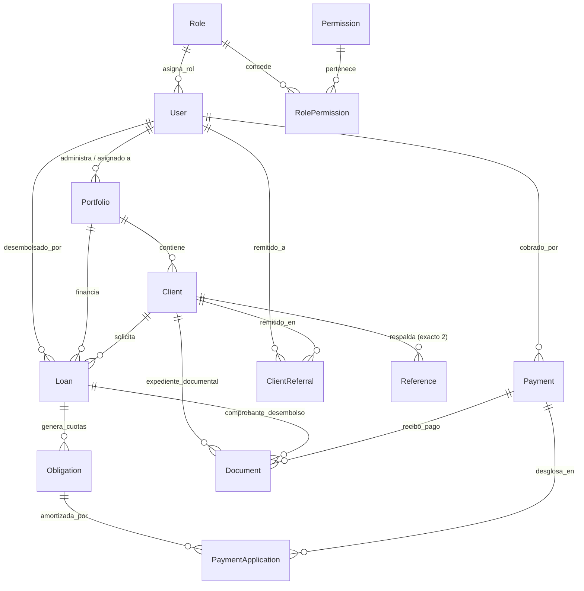

# 📐 Arquitectura Técnica — Cartera · Sistema de Cobranza y Gestión de Microcréditos

> **Documento Técnico de Referencia Integral**  
> Cubre la arquitectura de software, especificación de modelos relacionales, motor financiero dolarizado (USD), aislamiento de carteras, módulo de asesoría, seguridad basada en roles (RBAC) y motor de scoring/OCR.

---

## 1. Visión y Principios de Arquitectura

El sistema está diseñado bajo el patrón **Application Factory + Blueprints** en Flask con SQLAlchemy 2.x, priorizando:
- **Aislamiento Multi-Cartera**: Cada cartera es un silo operativo cerrado asignado a un operador con capital fijado en dólares (USD).
- **Consistencia Transaccional**: El motor de amortización y cascada de pagos garantiza integridad contable en todo momento (pago prioritario de intereses y amortización residual a capital).
- **Seguridad por Capas (Defense in Depth)**: Autenticación con Flask-Login, control granular de permisos en endpoints y plantillas (`@permission_required`), protección CSRF y mitigación de fugas de datos mediante filtrado a nivel de consulta SQLAlchemy.
- **Degradación Elegante**: Módulos auxiliares como OCR (EasyOCR / PyMuPDF) operan sin bloquear el flujo transaccional si las librerías o pesos de redes neuronales no están presentes en el entorno.

```
┌─────────────────────────────────────────────────────────────┐
│                 Capa Web / Presentación                     │
│      Jinja2 Templates (UI Moderna) + CSS Tokens Nativos     │
├─────────────────────────────────────────────────────────────┤
│                 Capa de Rutas / Controladores               │
│  auth, dashboard, clients, loans, payments, collections,    │
│  portfolios (Carteras), advisor (Asesoría), reports, admin  │
├─────────────────────────────────────────────────────────────┤
│                 Capa de Servicios y Negocio                 │
│  financial.py (Motor USD), scoring.py (Score 0-100),       │
│  documents.py (Almacenamiento trazable), ocr.py            │
├─────────────────────────────────────────────────────────────┤
│                 Capa de Datos y Persistencia                │
│    Flask-SQLAlchemy (Modelos ORM) + SQLite / PostgreSQL     │
└─────────────────────────────────────────────────────────────┘
```

---

## 2. Modelo de Datos y Esquema Relacional

### 2.1. Diagrama de Relaciones Principales



### 2.2. Entidades Principales

#### `Portfolio` (Carteras de Crédito)
- `id` (Integer, PK): Identificador secuencial.
- `name` (String 100): Denominación de la cartera (ej. "Cartera Norte USD").
- `description` (Text): Observaciones y cobertura geográfica o de sector.
- `user_id` (Integer, FK -> `user.id`): Operador de cobranza asignado.
- `assigned_capital_usd` (Numeric 12,2): Cupo o capital asignado en dólares por el Administrador.
- `active` (Boolean): Estado operativo de la cartera.
- `created_at` (DateTime): Fecha y hora de creación.

#### `Client` (Expediente del Cliente)
- `id` (Integer, PK)
- `code` (String 20, Unique): Código de identificación interna (`CL-XXXXX`).
- `portfolio_id` (Integer, FK -> `portfolio.id`): Cartera a la que pertenece exclusivamente.
- `first_name`, `last_name`, `identification_type`, `identification_number` (Unique).
- `country`, `city`, `address`, `phone`, `email`.
- `employer_name`, `employer_address`, `employer_phone`, `job_title`, `salary` (Datos laborales).
- `bank_name`, `account_type`, `account_number`, `account_holder` (Cuenta para desembolso).
- `collection_bank_name`, `collection_account_type`, `collection_account_number`, `collection_account_holder` (Cuenta para recaudo).
- `referred_to_advisor` (Boolean): Indicador rápido de remisión a asesor.
- `created_at` (DateTime).

#### `ClientReferral` (Remisiones al Asesor / Consultor)
- `id` (Integer, PK)
- `client_id` (Integer, FK -> `client.id`)
- `referred_by_id` (Integer, FK -> `user.id`): Administrador u operador que remite.
- `advisor_id` (Integer, FK -> `user.id`): Asesor asignado (rol `Consulta`).
- `reason` (String 120): Motivo principal ("mora", "cobro_dificil", "reestructuracion", "scoring").
- `notes` (Text): Instrucciones específicas para la gestión del asesor.
- `status` (String 20): `pendiente`, `en_gestion`, `finalizado`.
- `created_at`, `resolved_at` (DateTime).

#### `Notification` (Alertas Internas para Asesores)
- `id` (Integer, PK)
- `user_id` (Integer, FK -> `user.id`): Destinatario de la alerta.
- `title` (String 120): Título breve de la notificación.
- `message` (Text): Detalle del evento o remisión.
- `link` (String 255): Enlace directo al expediente o recurso.
- `read` (Boolean): Estado de lectura.
- `created_at` (DateTime).

#### `Loan` (Préstamo Dolarizado)
- `id` (Integer, PK)
- `code` (String 20, Unique): Código de crédito (`PR-XXXXX`).
- `client_id` (Integer, FK -> `client.id`)
- `portfolio_id` (Integer, FK -> `portfolio.id`): Cartera vinculada.
- `principal` (Numeric 12,2): Capital prestado en dólares ($75, $100, $125, $150 u otro).
- `interest_rate` (Numeric 6,4): Tasa periódica fija (por defecto 0.20 = 20.00%).
- `term_units` (Integer): Plazo (típicamente 1 cuota o ciclo acordado).
- `frequency` (String 20): `semanal` o `quincenal`.
- `biweekly_cycle` (String 20): `5-20`, `10-25`, `15-30` (o `semanal`).
- `first_due_date` (Date): Fecha de vencimiento exigible.
- `amortization_type` (String 20): `francesa` (cuota fija), `alemana`, o `bullet` (capital + 20% al vencimiento).
- `status` (String 20): `vigente`, `pagado`, `mora`, `anulado`.
- `outstanding_balance` (Numeric 12,2): Saldo de capital pendiente.

#### `Obligation` (Cuotas / Obligaciones Exigibles)
- `id` (Integer, PK)
- `loan_id` (Integer, FK -> `loan.id`)
- `installment_number` (Integer): Número de cuota (1..N).
- `due_date` (Date): Fecha de corte/vencimiento.
- `principal_amount` (Numeric 12,2): Componente de capital de la cuota.
- `interest_amount` (Numeric 12,2): Componente de interés de la cuota.
- `total_amount` (Numeric 12,2): Valor total exigible (`principal_amount + interest_amount`).
- `paid_principal` (Numeric 12,2): Capital abonado acumulado.
- `paid_interest` (Numeric 12,2): Interés abonado acumulado.
- `status` (String 20): `pendiente`, `parcial`, `pagada`.

#### `Payment` y `PaymentApplication`
- `Payment`: Encabezado transaccional (`code` `PG-XXXXX`, `amount`, `payment_date`, `status` `aplicado`/`anulado`, `voucher_reference`, `user_id`).
- `PaymentApplication`: Aplicación atómica de cada pago discriminando `principal_applied` e `interest_applied` sobre cada `Obligation`.

---

## 3. Motor Financiero en Dólares (USD)

### 3.1. Parámetros Globales Configurables por el Administrador
1. **Tasa de Interés Fija**: `interest_rate_percent = 20.0` (editable por Admin en `/admin/parametros`).
2. **Montos Predefinidos de Préstamo**: `allowed_loan_amounts_usd = [75, 100, 125, 150]` (editables, ampliables o reducibles por Admin).

### 3.2. Modalidades y Ciclos de Vencimiento
- **Modalidad Semanal**: El cobro se realiza exactamente a los 7 días calendario de la fecha de solicitud/desembolso (`solicitud + 7 días`).
- **Modalidad Quincenal (3 Ciclos Fijos)**:
  - **Ciclo 5-20**: Si se solicita entre los días 1 y 5, vence el día 20 del mismo mes. Si se solicita entre 6 y 20, vence el día 5 del mes siguiente.
  - **Ciclo 10-25**: Si se solicita entre los días 6 y 10, vence el día 25 del mismo mes. Si se solicita entre 11 y 25, vence el día 10 del mes siguiente.
  - **Ciclo 15-30**: Si se solicita entre los días 11 y 15, vence el día 30 del mismo mes. Si se solicita entre 16 y 30/31, vence el día 15 del mes siguiente.
  - El sistema cuenta con cálculo predictivo (`suggest_biweekly_cycle()`) que sugiere automáticamente el ciclo óptimo para maximizar el cumplimiento de pago.

### 3.3. Cascada Transaccional de Pagos (Waterfall Logic)
Cuando el cliente realiza un pago $Y$:
1. **Prioridad 1 — Cobertura de Intereses Exigibles**:
   $$\text{Abono Interés} = \min(Y, \text{Interés Pendiente})$$
2. **Prioridad 2 — Amortización a Capital**:
   Cualquier remanente después de liquidar los intereses se aplica directamente al saldo de capital del crédito:
   $$\text{Abono Capital} = \min(Y - \text{Abono Interés}, \text{Capital Pendiente})$$
3. **Casos de Renovación / Saldo Remanente**:
   Si el cliente amortiza parcialmente el capital $(X - Z)$, el siguiente corte calcula el nuevo valor exigible sobre la base de capital remanente más el interés acordado.
4. **Anulación Transaccional**:
   La anulación de un pago revierte las aplicaciones de capital e interés sobre cada cuota, restaura el estado `pendiente`/`parcial` y recalcula el saldo insoluto sin alterar la auditoría histórica.

---

## 4. Arquitectura de Silos por Cartera (Portfolios)

1. **Jerarquía Administrativa**:
   - El **Administrador** posee vista global de todas las carteras, puede crear nuevas carteras, asignar o reasignar capital en USD y vincular operadores.
   - Cada **Operador** únicamente puede consultar y operar sobre los clientes, préstamos y pagos pertenecientes a su cartera activa seleccionada.
2. **Alternancia de Carteras**:
   - Los operadores con múltiples carteras asignadas alternan entre ellas mediante `GET /carteras/alternar/<id>`, lo que actualiza la variable de sesión `session['active_portfolio_id']`.
3. **Inyección de Contexto Global**:
   - `app/__init__.py` registra un context processor que inyecta en todas las plantillas Jinja2:
     - `active_portfolio`: Objeto de la cartera en uso.
     - `available_portfolios`: Lista de carteras a las que el usuario en sesión tiene acceso.
     - `unread_notifs_count`: Contador de notificaciones pendientes para el usuario.

---

## 5. Módulo de Asesoría y Perfil Consultor

Para clientes con dificultades de recaudo, mora o necesidades de reestructuración:
1. **Remisión al Asesor**:
   - Desde la ficha técnica del cliente, el operador o admin ejecuta `POST /clientes/<id>/enviar-asesor`.
   - Se crea el registro `ClientReferral` y se despacha una alerta `Notification` al asesor seleccionado.
2. **Panel Restringido del Asesor (Rol `Consulta`)**:
   - El asesor con rol `Consulta` cuenta con un entorno blindado: **no tiene acceso a préstamos, carteras globales, parámetros ni recaudos directos**.
   - Su barra de navegación solo exhibe: **Dashboard de Asesoría** (`/asesor/`) y **Bandeja de Notificaciones** (`/asesor/notificaciones`).
   - Visualiza los clientes remitidos con:
     - Fotografía e información de contacto.
     - Score crediticio y banda de riesgo.
     - Estado de mora y días de retraso.
     - Saldo de capital adeudado e intereses en mora exactos.
     - Herramienta para marcar la gestión como completada con notas operativas.

---

## 6. Expediente Digital y Manejo de Documentos

El expediente sustituye cualquier noción de "hoja de vida" tradicional por un expediente documental estructurado para análisis de riesgo:
- **4 Evidencias Digitales Obligatorias**:
  1. `foto_deudor`: Fotografía tipo retrato del titular.
  2. `foto_trabajo`: Fotografía del lugar de trabajo o actividad productiva.
  3. `fachada`: Fotografía del domicilio o fachada residencial.
  4. `identificacion`: Documento de identidad / Cédula escaneada.
- **Nomenclatura Trazable en Almacenamiento Físico**:
  `{entidad}/{id}/{entidad}-{id}-{tipo}-{fecha}-{uuid8}.{extension}`
  Ejemplo: `cliente/14/cliente-14-identificacion-20260908-a1b2c3d4.pdf`
- **Reemplazo Seguro**: Al subir una versión actualizada de una foto o cédula, el registro anterior es eliminado de forma segura y el nuevo archivo queda debidamente auditado.

---

## 7. Módulo de OCR y Procesamiento Inteligente

- **EasyOCR (Imágenes JPG/PNG)**: Lee imágenes de documentos de identidad colombianos y recibos para extraer automáticamente:
  - Cédula / Número de identificación (expresiones regulares `\b\d{6,10}\b`).
  - Nombres y apellidos probables.
- **PyMuPDF (PDFs Digitalizados y Escaneados)**: Extrae texto vectorial de documentos PDF o renderiza a pixmap para análisis OCR si el PDF proviene de un escaneo fotográfico.
- **Degradación Segura**: Si EasyOCR no está instalado o no dispone de pesos preentrenados, el sistema no produce excepciones 500; retorna `ok: true` con mensaje de degradación elegante permitiendo la digitación manual sin fricciones.

---

## 8. Seguridad, RBAC y Auditoría

### Roles Nativos
1. **`Administrador`**: Acceso integral al sistema, creación de carteras, usuarios, roles, parámetros del sistema y registro completo de auditoría.
2. **`Operador de cobranza`**: Creación de clientes y préstamos en su cartera activa, aplicación de pagos, gestión de cobranza y exportación de recibos.
3. **`Consulta` (Asesor)**: Acceso exclusivo a clientes remitidos, historial de gestiones de cobro, notas de reestructuración y alertas.

### Pistas de Auditoría (`Audit`)
Toda acción relevante queda registrada de forma inmutable:
- `user_id`: Quién ejecutó la acción.
- `action`: Descripción canónica ("Crear cliente", "Crear préstamo", "Registrar pago", "Anular pago", "Remitir a asesor").
- `entity_type` y `entity_id`: Recurso afectado.
- `details`: Parámetros clave modificados.
- `ip_address`: Dirección IP del cliente.
- `created_at`: Timestamp UTC.

---

## 9. Panel Principal (Dashboard) e Indicadores de Cartera

El Panel Principal (`/`) centraliza el estado operativo, contable y de riesgo de la cartera activa en tiempo real. Los archivos involucrados son:
- **Controlador / Lógica**: [`app/routes/dashboard.py`](file:///c:/Users/lopez/Desktop/Cartera/cobranza-app/app/routes/dashboard.py) (`def index()`)
- **Presentación / Plantilla**: [`app/templates/dashboard.html`](file:///c:/Users/lopez/Desktop/Cartera/cobranza-app/app/templates/dashboard.html)

### 9.1. Indicadores Principales (KPI Cards)

| Indicador | Variable Interna | Ubicación en Código | Regla de Negocio / Fórmula de Cálculo |
|---|---|---|---|
| **Saldo de Cartera** | `indicators.cartera_total` | `dashboard.py`: L46-54 | **Capital total asignado a la cartera (`Portfolio.assigned_capital_usd`)**. Refleja el cupo total financiero en dólares asignado a la cartera activa por el Administrador. Si el usuario es Administrador y no tiene una cartera filtrada en sesión, totaliza el capital asignado de todas las carteras registradas. |
| **Cartera Vigente (Al día)** | `indicators.cartera_vigente` | `dashboard.py`: L65 | **Capital en curso sin mora**: $\max(0.0, \text{Saldo Insoluto Total} - \text{Saldo Vencido})$. Es el saldo pendiente de créditos activos cuyas obligaciones no han superado su fecha límite de pago. |
| **Cartera Vencida (En mora)** | `indicators.cartera_vencida` | `dashboard.py`: L59-64 | **Saldo vencido exigible**: $\sum \text{pending\_balance}$ de todas las cuotas (`Obligation`) cuyo estado sea diferente de `"pagada"`, saldo $> 0$ y `due_date < today`. Incluye además el conteo de cuotas vencidas (`obligaciones_vencidas`). |
| **Interés generado este mes** | `indicators.interes_mes` | `dashboard.py`: L86-101 | **Rendimiento financiero efectivamente liquidado**: Se contabiliza exclusivamente el interés de **créditos con estatus `"pagado"`** que hayan registrado pagos en los últimos 30 días (`today - 30 días`). Excluye créditos vigentes no liquidados y créditos en mora para garantizar que solo se reconozca ingreso realizado/cobrado. |

### 9.2. Métricas Secundarias

- **Clientes activos** (`indicators.clientes`): Cantidad de clientes registrados en la cartera activa.
- **Préstamos en curso** (`indicators.prestamos_activos`): Total de préstamos con estado `"activo"` o `"mora"`.
- **Cuotas en mora** (`indicators.obligaciones_vencidas`): Número de cuotas con fecha de vencimiento superada e impagas.
- **Gestiones de cobro hoy** (`collections_today`): Conteo de gestiones registradas en `CollectionManagement` cuya próxima fecha de contacto coincide con la fecha actual.

### 9.3. Tablas Operativas del Dashboard

1. **Próximos Vencimientos**: Muestra la siguiente cuota inmediata de cada crédito dentro de un horizonte configurable (`Parameter.get("dias_proximos_vencer")`, por defecto 15 días), permitiendo búsqueda rápida por texto (Nombre o Cédula).
2. **Cartera en Mora**: Relación de cuotas vencidas con días de atraso y acceso directo a gestión de cobro o remisión a asesor.
3. **Últimos Pagos Aplicados**: Registro de los 8 pagos más recientes recibidos con acceso a su comprobante digital.

---

## 10. Pruebas y Validación de Calidad

El proyecto cuenta con suites de pruebas unitarias y de integración que validan el 100% de los flujos críticos:
```bash
# Ejecutar todas las pruebas del sistema
.venv\Scripts\python -m unittest discover tests -v

# Pruebas específicas del motor de carteras y asesor
.venv\Scripts\python -m unittest tests.test_carteras_and_advisor -v

# Auditoría integral end-to-end (84 verificaciones)
.venv\Scripts\python tests/test_audit_full.py
```
Todas las suites ejecutan con código de salida 0 (100% PASS).

